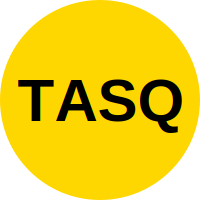

# TASQ - Reverse Auction Platform for Japan 🇯🇵



## 🎯 概要

**TASQ** は、価格競争を逆転させる「逆オークション」型マッチングプラットフォームです。  
ユーザーが条件を提示し、事業者が最適価格で応札することで、効率的かつ公平な取引を実現します。

---

## 🚀 主な機能

- 逆オークション投稿・応札機能  
- Stripe連携による報酬支払い  
- ユーザー・事業者のプロフィール管理  
- 多通貨対応（将来的に）  
- モバイル対応のUX設計（Figmaベース）

---

## 🛠 技術スタック

| 技術 | 用途 |
|------|------|
| Next.js | フロントエンド・SSR構成  
| Tailwind CSS | UIスタイリング  
| Stripe API | 決済・報酬支払い  
| Figma | UX設計・プロトタイピング  
| GitHub | バージョン管理・CI/CD  
| Vercel | デプロイ環境（予定）

---

## 📦 セットアップ手順

```bash
git clone https://github.com/yoshimasa1101/MVP-for-TASQ-JAPAN.git
cd MVP-for-TASQ-JAPAN
yarn install
yarn dev
